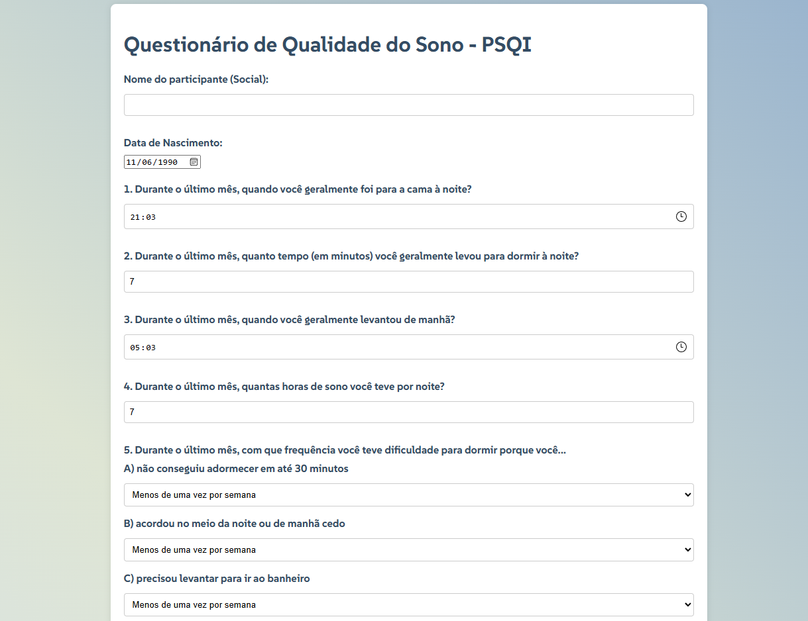

# Questionário de Qualidade do Sono - PSQI

## Descrição

Este projeto é um questionário online para avaliar a qualidade do sono, baseado no questionário PSQI (Pittsburgh Sleep Quality Index).

## Tecnologias

Este projeto foi desenvolvido usando as seguintes tecnologias:

* **HTML:**  Para a estrutura da página web.
* **CSS:**  Para o estilo da página web.
* **JavaScript:**  Para interatividade e funcionalidades da página web.
* **Python:**  Para a lógica do servidor.
* **Flask:**  Para o framework web.
* **SQLite:**  Para o banco de dados.

## Instalação

1. **Instale o Python:**  Baixe e instale o Python da [https://www.python.org/](https://www.python.org/).
2. **Instale as dependências:**  Execute o seguinte comando no terminal:
   ```bash
   pip install -r requirements.txt

## Configuração

1. Crie o banco de dados: Crie um arquivo chamado psqi-form.db na pasta raiz do projeto.
2. Inicialize o banco de dados: Execute o seguinte comando no terminal:
  python app.py init_db

## Execução 

1. Preencha o questionário: Preencha os campos do questionário com suas informações.
2. Envie o questionário: Clique no botão "Enviar" para enviar as respostas.

## Contribuições

Contribuições são bem-vindas! Abra um problema para relatar bugs ou sugestões de melhorias.

## Licença
Este projeto é licenciado sob a licença MIT. Veja o arquivo LICENSE para mais detalhes.


